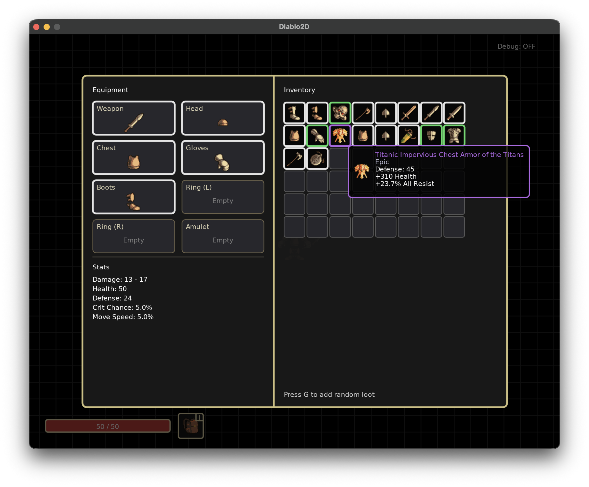

# Diablo2D

Top-down action roguelike inspired by Diablo, built with LÖVE (Love2D) and Lua. Explore a procedurally generated forest, fight roaming packs, level up, and gather randomized gear before visiting small towns for vendors and respite.

## Current State
- Homegrown ECS in the world scene: entities are pure data, systems (`player_input`, `movement`, `wander`, `render`) operate on component tables.
- Basic sandbox world with a controllable hero and a wandering enemy to validate systems.
- Scene manager with stack-based overlays; inventory scene renders as a modal without pausing the world draw order.
- Inventory overlay UI stub (split equipment/inventory columns, translucent backdrop).
- Item generator with slot-aware prefixes/suffixes, rarity weighting, and tooltips showing rolled stats.

## Feature Targets (Early Phase)
- Procedural forest overworld with repeatable runs.
- Combat against monster packs with XP and leveling.
- Random loot feeding inventory and equipment.
- Small towns containing NPC vendors and shops.

## Getting Started
1. Install [LÖVE](https://love2d.org/) 11.x or later.
2. Clone this repository.
3. Run `love .` from the project root, or open the bundled `Diablo.love` directly with LÖVE.

## Roadmap
- Expand ECS scaffolding: shared entity helpers, additional components (health, AI, combat), and system registration utilities.
- Hook inventory/equipment data into the UI, add interactions (equip, drop, compare).
- Prototype procedural world generation and encounter spawning.
- Implement combat loop, loot tables, and progression pacing.
