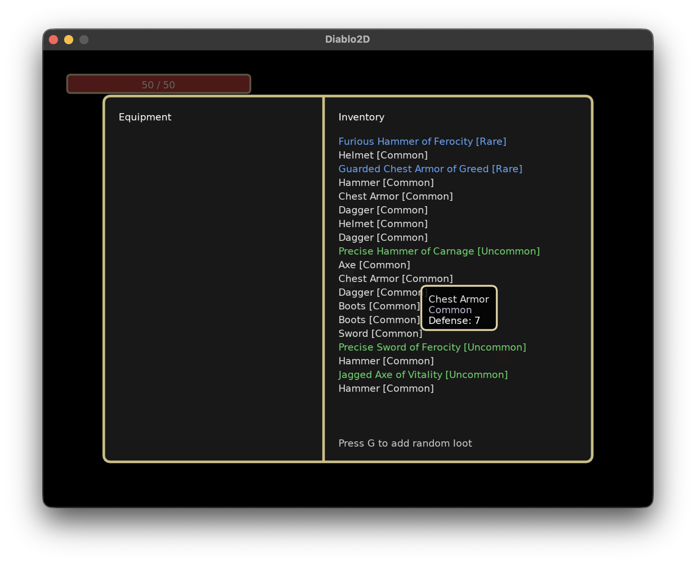

# Diablo2D

Top-down action roguelike inspired by Diablo, built with LÖVE (Love2D) and Lua. Explore a procedurally generated forest, fight roaming packs, level up, and gather randomized gear before visiting small towns for vendors and respite.

## Current State
- Homegrown ECS module (`modules/ecs.lua`): reusable entity/component management with efficient component set queries. Any scene can opt into ECS via `ECS.init(scene)`.
- `WorldScene` uses ECS: entities are pure data, systems (`player_input`, `mouse_look`, `mouse_movement`, `movement`, `wander`, `detection`, `chase`, `render`, `starter_gear`) operate on component tables using efficient queries.
- Dual input system: keyboard movement (WASD, Q/Z for AZERTY keyboards) and right-click mouse movement. Mouse look system tracks cursor direction for combat targeting with visual arrow indicator.
- Starter gear system: automatically generates and equips common-quality weapon and armor (helmet, chest, boots) when world initializes.
- Entity factories (`entities/player.lua`, `entities/foe.lua`) provide consistent creation patterns with configurable properties (speed, detection range, health, etc.).
- AI behavior system: foes detect player within configurable range and switch between wandering and chasing. Detection circles visible in debug mode.
- Basic sandbox world with a controllable hero and multiple foes with different speeds and detection ranges.
- Scene manager with stack-based overlays; inventory scene renders as a modal without pausing the world draw order.
- Inventory overlay UI stub (split equipment/inventory columns, translucent backdrop).
- Item generator with slot-aware prefixes/suffixes, rarity weighting, and flexible `ItemGenerator.roll()` API supporting rarity/itemType overrides and source tagging.
- Utility modules: `modules/vector.lua` for vector math (normalize, distance, length); `system_helpers/coordinates.lua` for screen-to-world coordinate conversion.
- Debug mode: press 't' to toggle debug visualization (detection circles). Debug status displayed in top-right corner.
- UI: health bar positioned in bottom-left corner; debug status in top-right corner; mouse look direction arrow indicator around player.

## Feature Targets (Early Phase)
- Procedural forest overworld with repeatable runs.
- Combat against monster packs with XP and leveling.
- Random loot feeding inventory and equipment.
- Small towns containing NPC vendors and shops.

## Getting Started
1. Install [LÖVE](https://love2d.org/) 11.x or later.
2. Clone this repository.
3. Run `love .` from the project root, or open the bundled `Diablo.love` directly with LÖVE.

## Roadmap
- Expand ECS scaffolding: additional components (combat stats, damage), and system registry utilities.
- Extend foe types: create specialized foe factories with varied detection ranges, speeds, and behaviors.
- Hook inventory/equipment data into the UI, add interactions (equip, drop, compare).
- Prototype procedural world generation and encounter spawning.
- Implement combat loop, loot tables, and progression pacing.
